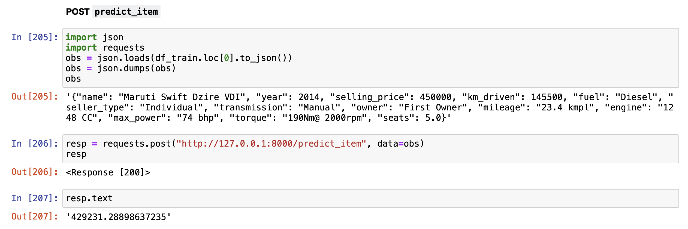

## Выводы по работе
1. Протестированы различные подходы обработки фичей.
2. Протестированы различные подходы к построению линейных моделей регрессии.
3. Наибольший буст дало добавление категориальных фичей в модель $+18\%$ $R^2$. Однако метод кодирования `OneHotEncoding` кажется не оптимальным, из-за большого количества уникальных категорий.
4. Также значительный прирост $+13\%$ $R^2$ обеспечила log-трансформация таргета. Это объясняется тем, что изначальное распределение таргета имеет сильное смещение вправо. После логарифмирования распределение таргета стало похоже на нормальное.
5. В конце были реализованы бизнес-метрики, учитывающие логику бизнес-заказчиков. После подсчета значений на всех моделях, бизнес-метрики показали сильную корреляцию с исходными метриками $R^2$ и $MSE$.
6. Финально был реализован сервис на FastAPI для получения предсказаний модели.

## Лучшая модель
| Название | $R^2$ Test| $MSE$ Test| $Weighted \text{ } MAE$ Test|
|----------|----------|----------|----------|
| `Model_Ridge_log_target`| $0.911$| $51\text{ }270\text{ }596\text{ }360$  | $101\text{ }169$|

## Структура репозитория
```
.
├── AI_HW1_Regression_with_inference_pro.ipynb  <-- Ноутбук с решением заданий
├── README.md
├── data
│   ├── model.joblib             <-- Лучшая модель
│   ├── preproc.joblib           <-- Пайплайн с препроцессингами
├── feature_processing_basic.py  <-- Код для трансформера FeaturePreprocessorBasic
├── assets                       <-- Папка со скриншотами работы сервиса
│   ├── image-1.png
│   └── image.png
└── main.py                      <-- Сервис на FastAPI
```

## Работа сервиса
### Ручка `predict_item`

### Ручка `predict_items`
